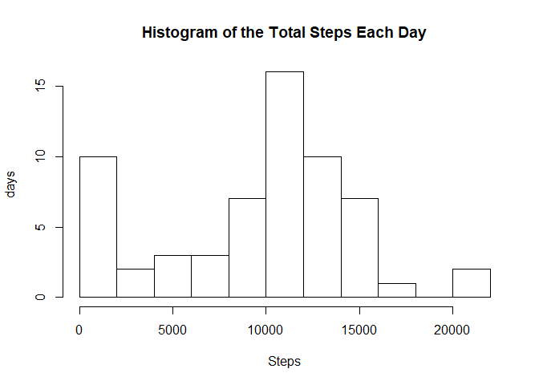
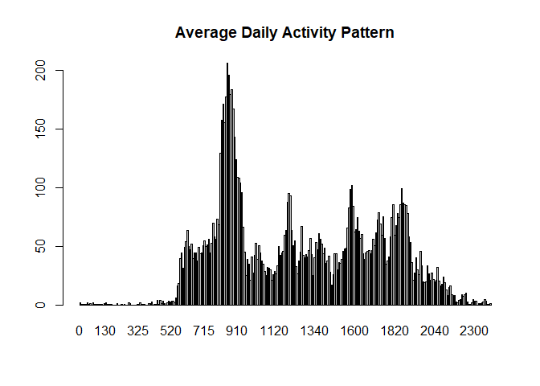
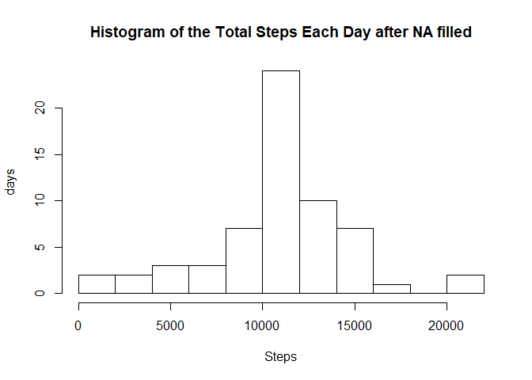
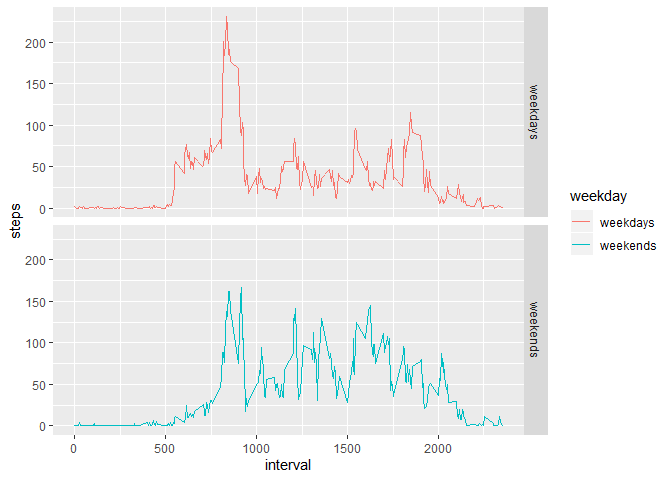

## Loading and preprocessing the data

The activity monitoring data is unzipped and loaded. The summary is shown below.


```r
unzip("act.zip")
activity <- read.csv("activity.csv")
str(activity)
```

```
## 'data.frame':	17568 obs. of  3 variables:
##  $ steps   : int  NA NA NA NA NA NA NA NA NA NA ...
##  $ date    : Factor w/ 61 levels "2012-10-01","2012-10-02",..: 1 1 1 1 1 1 1 1 1 1 ...
##  $ interval: int  0 5 10 15 20 25 30 35 40 45 ...
```

## What is mean total number of steps taken per day?


```r
d_steps <- with(activity, tapply(steps, date, sum, na.rm = TRUE))
d_mean <- as.integer(mean(d_steps, na.rm = TRUE))
d_median <- as.integer(median(d_steps, na.rm = TRUE))
hist(d_steps, breaks = 10, xlab = "Steps", ylab = "days",
     main = "Histogram of the Total Steps Each Day")
```

<!-- -->

The mean number of steps taken per day is 9354 and the median number is 10395.

## What is the average daily activity pattern?

The average daily activity pattern is shown as the number of steps taken over time series

```r
t_steps <- with(activity, tapply(steps, interval, mean, na.rm = TRUE))
barplot(t_steps, main = "Average Daily Activity Pattern")
```

<!-- -->

```r
mt <- activity[which.max(t_steps), 3]
```

The interval 835 contains the maximum number of steps.

## Imputing missing values

The missing values are found by

```r
row_na <- is.na(activity$steps)
mv <- sum(row_na)
```

There are 2304 missing values in the original data set.
The missing values can be filled with average steps taken on each interval over the testing dates.


```r
activity$steps2 <- replace(activity[ , 1], which(row_na), t_steps)
d_steps2 <- with(activity, tapply(steps2, date, sum, na.rm = TRUE))
hist(d_steps2, breaks = 10, xlab = "Steps", ylab = "days",
     main = "Histogram of the Total Steps Each Day after NA filled")
```

<!-- -->

```r
mean_steps2 <- as.integer(mean(d_steps2, na.rm = TRUE))
median_steps2 <- as.integer(median(d_steps2, na.rm = TRUE))
```

So after the missing values filled, the mean number of steps taken each day is 10766 and the median number is 10766. Both numbers are higher than the original ones because the missing values were counted as 0 when calculating the total number of daily steps.

## Are there differences in activity patterns between weekdays and weekends?


```r
activity$day <- weekdays(as.Date(activity$date))
wdays <- c("Monday", "Tuesday", "Wednesday", "Thursday", "Friday")
ends <- c("Saturday", "Sunday")
activity$wk <- activity$day
for(i in 1:nrow(activity)) {
if(activity$day[i] %in% ends) activity$wk[i] <- "weekends"
else activity$wk[i] <- "weekdays"
}
t_steps2 <- with(activity, tapply(steps2, list(interval, wk), mean, na.rm = TRUE))
library(reshape2)
library(ggplot2)
t_steps3 <- melt(t_steps2)
names(t_steps3) <- c("interval", "weekday", "steps")
qplot(interval, steps, data = t_steps3, facets = weekday~., 
      geom = "line", color = weekday)
```

<!-- -->

In average, the activity patterns of weekdays and weekends are different in 

1. The active time starts earlier in weekdays than in weekends. In weekdays, the activity starts at ~5:00 while it starts after ~7:00 in weekends.

2. The rest time also starts earlier in weekdays than in weekends. In weekdays, the activity stops after ~20:00 while it stops after ~21:00 in weekends.  

3. Both patterns in weekdays and weekends contain multiple peaks while the pattern of weekdays contains an obvious high peak above 200 steps at ~8:30.
